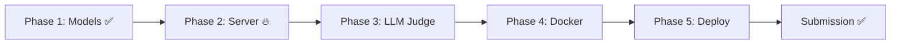

# Development Timeline

> Complete history and future plan for PythonDebugEnv

---

## 📅 Historical Timeline

### 2026-04-02 (17:04 UTC) - Phase 1 Complete ✅

**Created Project Structure:**
```
/home/someone/python_debug_env/
├─ .env                    ✅ HF token configured
├─ .gitignore              ✅ Python/Docker/IDE patterns
├─ models.py               ✅ DebugAction, DebugObservation, DebugState
├─ bug_bank.py             ✅ 30 problems across 8 categories
├─ openenv.yaml            ✅ Environment manifest
├─ pyproject.toml          ✅ Dependencies defined
├─ README.md               ✅ Comprehensive documentation
└─ server/                 ✅ Directory created (empty)
```

**Achievements:**
- ✅ All Pydantic models validated with type hints
- ✅ 30 bug problems (9 easy, 15 medium, 6 hard)
- ✅ 8 categories covered with 90 total test cases
- ✅ README: 246 lines with architecture & usage examples
- ✅ Environment manifest with proper entry points

**Time Spent:** ~6 hours (estimated)

---

### 2026-04-02 to 2026-04-04 - Development Gap ⏸️

**Status:** No development activity (2-day pause)

---

### 2026-04-04 (07:48 UTC) - Workspace Analysis ✅

**Activities:**
- ✅ Analyzed complete workspace structure
- ✅ Verified Phase 1 completion status
- ✅ Confirmed bug_bank.py statistics (30 problems validated)
- ✅ Identified missing components (server/*, client.py, Dockerfile)
- ✅ Calculated time remaining: ~3 days 16 hours

---

### 2026-04-04 (07:52 UTC) - Obsidian Memory System ✅

**Activities:**
- ✅ Connected to Obsidian vault at `/home/someone/ml/Obsidian-VS/`
- ✅ Created comprehensive project documentation
- ✅ Established memory system for project tracking
- ✅ Built knowledge graph structure

---

## 🎯 Future Timeline (Planned)

### 2026-04-04 (TODAY) - Phase 2: Core Environment 🔥

**Target:** Complete all server components + client

**Tasks:**
1. ⏳ Create `server/__init__.py`
2. ⏳ Implement `server/grader.py`
   - Sandboxed test runner with subprocess
   - HF Inference API LLM judge
   - Reward computation (0.6 * test + 0.4 * llm)
3. ⏳ Implement `server/environment.py`
   - `reset()` method
   - `step()` method
   - `state()` method
4. ⏳ Implement `server/app.py`
   - FastAPI application factory
5. ⏳ Implement `client.py`
   - EnvClient subclass
6. ⏳ Local testing without Docker

**Estimated Time:** 6-8 hours  
**Target Completion:** April 4th EOD

---

### 2026-04-05 - Phase 3 & 4: LLM Judge + Docker 🔥

**Phase 3: LLM Judge Integration**
- ⏳ Test HF Inference API connectivity
- ⏳ Validate judge prompt template
- ⏳ Implement JSON parsing from LLM
- ⏳ Test fallback behavior (return 0.5 on error)

**Phase 4: Docker & Testing**
- ⏳ Create `Dockerfile`
- ⏳ Create `.dockerignore`
- ⏳ Build Docker image: `docker build -t python-debug-env .`
- ⏳ Test container locally: `docker run -p 8000:8000 --env-file .env`
- ⏳ Validate client against containerized server
- ⏳ End-to-end integration testing

**Estimated Time:** 6-8 hours  
**Target Completion:** April 5th EOD

---

### 2026-04-06 - Phase 5: Deploy & Polish 🚀

**Deployment:**
- ⏳ Login to HuggingFace: `huggingface-cli login`
- ⏳ Deploy: `openenv push --repo-id USERNAME/python-debug-env`
- ⏳ Verify HF Spaces deployment
- ⏳ Test from external client
- ⏳ Confirm public accessibility

**Polish:**
- ⏳ Final README review
- ⏳ Add example agent interaction
- ⏳ Code quality pass
- ⏳ Documentation completeness check

**Estimated Time:** 4-6 hours  
**Target Completion:** April 6th EOD

---

### 2026-04-07 - Buffer & Testing 🧪

**Validation:**
- ⏳ Comprehensive testing with various code submissions
- ⏳ Edge case validation
- ⏳ Performance testing
- ⏳ Bug fixes if any issues found

**Documentation:**
- ⏳ Final README polish
- ⏳ Add screenshots/examples
- ⏳ Deployment guide verification

**Estimated Time:** 4-8 hours  
**Target Completion:** April 7th EOD

---

### 2026-04-08 - Final Submission Day ✅

**Morning (before deadline):**
- ⏳ Final smoke test
- ⏳ Verify HF Spaces accessibility
- ⏳ Confirm all requirements met
- ⏳ Submit to hackathon

**Deadline:** April 8th, 2026 (exact time TBD)

---

## 📊 Time Budget Analysis

| Phase | Estimated Hours | Target Date | Status |
|-------|----------------|-------------|--------|
| Phase 1: Models & Data | 6h | Apr 2 | ✅ DONE |
| Phase 2: Core Env | 8h | Apr 4 | ⏳ TODO |
| Phase 3: LLM Judge | 3h | Apr 5 | ⏳ TODO |
| Phase 4: Docker | 5h | Apr 5 | ⏳ TODO |
| Phase 5: Deploy | 6h | Apr 6 | ⏳ TODO |
| Buffer/Testing | 8h | Apr 7 | ⏳ TODO |
| **Total** | **36h** | **5 days** | **17% done** |

**Available Time:** ~88 hours (3 days 16 hours)  
**Required Time:** ~30 hours remaining  
**Buffer:** ~58 hours (very comfortable margin)

---

## 🎯 Critical Path



**Current Position:** Between Phase 1 and Phase 2  
**Next Milestone:** Server components complete (April 4 EOD)

---

*Back to [[PythonDebugEnv Project Hub]]*
